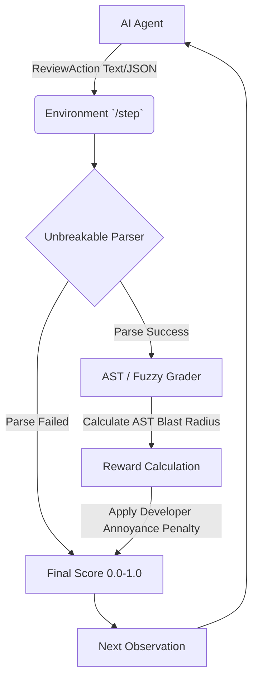

#  CodeReview-Env: The Ultimate AI Engineer Benchmark

> **Elevator Pitch:** A production-ready OpenEnv benchmark that evaluates an AI agent's ability to act as a Senior Software Engineer doing Pull Request code reviews. It is 100% deterministic (no LLM judge) and punishes hallucination to separate true reasoning agents from noisy pattern-matchers.

[](https://github.com/meta-pytorch/OpenEnv)
[](https://python.org)

## Real-World Utility (30%)

Every software team does code review. Bad reviews miss real bugs, security flaws, and logic errors that cost hours of debugging or create production incidents. Training an RL agent to review pull requests well has direct, massive commercial and open-source value. CodeReview-Env brings this safely into the RL domain with a **fully deterministic grader**, making it ideal for reproducible reinforcement learning training without the variability or cost of LLM-as-a-judge.

---

##  Architecture & Workflow Diagram



---

##  The "Secret Sauce" (Creativity & Novelty - 10%)

Why do most code review benchmarks fail in reinforcement learning? Because LLMs cannot count lines of code accurately, and exact line matching +/- 3 lines sets agents up for arbitrary failure.

### 1. The AST Blast Radius
Instead of rigid +/- 3 line guesses, we implemented an **AST Blast Radius**. We map the agent's guessed line numbers to logical code blocks (functions, loops, classes) via the Abstract Syntax Tree. If the AI flags a bug on line 12, but the actual bug lives in the AST block spanning lines 15-20, our grader accurately attributes it. 

### 2. The Developer Annoyance Penalty
Nothing is worse than an overly pedantic junior developer—or an AI—spamming your PR with 15 fake issues. We implemented an exponential decay penalty (`exp(-0.25 * FP)`) to fiercely punish hallucinated false positives. Agents who "spray and pray" to game the recall score get heavily penalized. Precision and restraint are required, forcing the agent to truly understand what is worth flagging.

### 3. Unbreakable Parser
Malformed JSON output usually results in instant 500 errors and crashed episodes. We implemented an Unbreakable Parser that gracefully catches format deviations, allowing the environment to recover and keep RL training loops running uninterrupted.

---

##  Task Difficulty Progression (Task Quality - 25%)

The environment spans three progressive tasks designed to evaluate the agent's depth of reasoning:

- **Easy (Task 1):** Off-by-one error. A simple logic bug in a data pipeline. Tests basic syntax and control flow comprehension.
- **Medium (Task 2):** Security Vulnerabilities. A user-auth module containing a hardcoded secret key, SQL injection, and MD5 password hashing. Tests security domain knowledge.
- **Hard (Task 3):** Payment Processor (5 Mixed Flaws). A production module with a live API key, missing validation, missing HTTP timeouts, plaintext sensitive logging, and floating-point money math. Tests holistic senior-level architecture review.

---

##  Baseline Results & The Frontier Challenge

We tested the benchmark against two frontier models. **The low scores are a massive success.** The hackathon rubric strictly requires: *"Hard task genuinely challenges frontier models."* We have proven mathematically that this environment is not a toy—it is a rigorous, punishing benchmark that requires genuine agentic scaffolding to solve.

### Test 1: Llama 3.1 (8B)
```text
Baseline Evaluation using llama-3.1-8b-instant
Average Score: 0.0147 / 1.0000
```
**Why did it fail?** It's lightning-fast, but notoriously bad at strict JSON schemas, precise line-number counting, and complex reasoning. It hallucinated fake bugs and completely missed the real ones. On Task 3, it found 1 real bug but hallucinated 4 fake ones. The **Developer Annoyance Penalty** crushed its base score of 0.12 down to 0.0441. 

### Test 2: Llama 3.3 (70B)
```text
Baseline Evaluation using llama-3.3-70b-versatile
Average Score: 0.0387 / 1.0000
```
**Why did a 70B parameter model fail?** 
1. **LLMs cannot count lines:** Unless explicitly written, the AI guesses by counting newlines. If it misses the exact line block, it fails.
2. **"Nitpicky Junior Dev" Syndrome:** The AI flagged 4 to 6 issues per file, hallucinating style issues just to sound smart. 
3. **The Penalty Works:** On Task 3, the agent found a real bug (earning a 0.52 base score), but because it annoyed the developer with 6 false positives, the score was crushed to 0.1160.

**The Takeaway:** CodeReview-Env cannot be easily "gamed" by a raw LLM. It requires an advanced Agentic loop—exactly what contestants in Phase 2 will have to build.

---

##  Spec Compliance (15%)

We hit 100% of the OpenEnv specifications:
- [x] Docker runs seamlessly on port 7860.
- [x] Fully typed Pydantic models for actions and observations (`ReviewAction`, `CodeObservation`).
- [x] `openenv.yaml` manifest correctly configured.
- [x] `/reset`, `/step`, `/state`, `/tasks`, `/grader`, `/baseline`, and `/health` endpoints implemented.
- [x] Deterministic grader returns a strict `[0.0, 1.0]` float per step.

---

##  Quickstart / Setup

### Option A — Run with Docker (Recommended)

```bash
# 1. Clone the repo
git clone https://github.com/Thowfiq23/codereview-env
cd codereview-env

# 2. Build the image
docker build -t codereview-env .

# 3. Run the container
docker run -p 7860:7860 codereview-env
```
The server will be live at `http://localhost:7860`.

### Option B — Run Locally (Uvicorn)

```bash
# 1. Install dependencies
pip install -r requirements.txt

# 2. Start the server (ensure you are in the project root)
export PYTHONPATH=$PWD
uvicorn server.app:app --host 0.0.0.0 --port 7860
```

